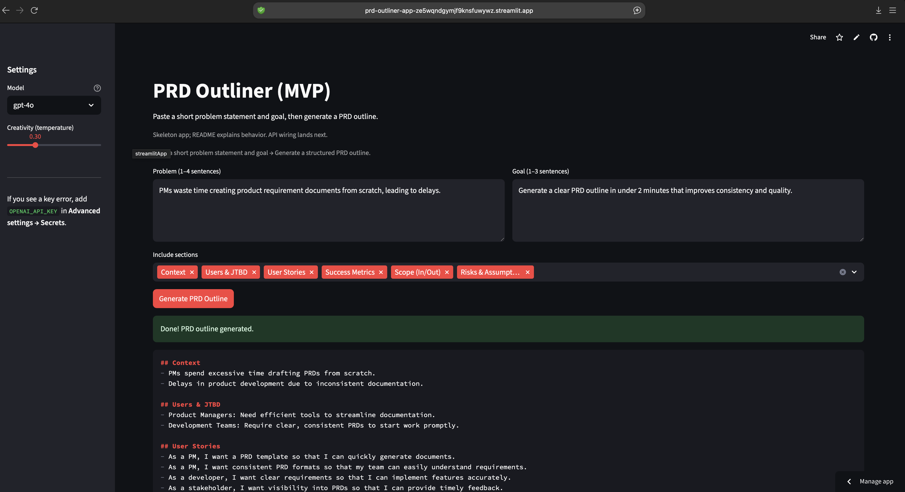
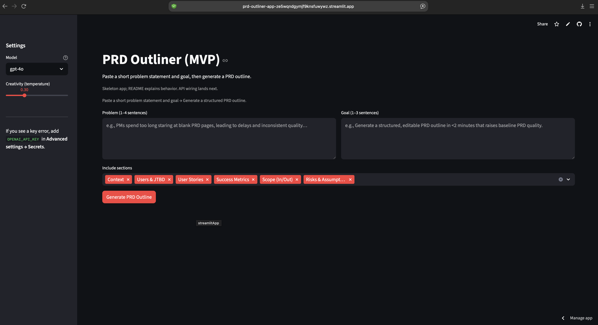

# PRD Outliner (OpenAI + Streamlit)

Prototype to streamline PRD drafting: paste a short problem + goal → generate a structured PRD outline in under 2 minutes.

---

# Demo
- Live app: https://prd-outliner-app-ze5wqndgymjf9knsfuwywz.streamlit.app

---

# How it works
- Input → short problem statement + goal (+ optional section toggles)  
- Logic/Model → prompt templates with `gpt-4o-mini` / `gpt-4o`  
- Output → PRD outline (context, users, user stories, metrics, scope, risks) with Copy + Download Markdown

---

# Results (v0.1)
- Protocol: 8 internal runs (varied inputs; both `gpt-4o-mini` and `gpt-4o`)  
- Score: 7 / 8 usable outlines (87.5%)  
- Notes / fixes planned:  
  1) Occasionally repeats headings → fixed with tighter prompt.  
  2) Long inputs slowed response → added spinner + input length hint.  

---

# Try it
pip install -r requirements.txt

# Option A (Streamlit Cloud): set key in Settings → Secrets as OPENAI_API_KEY
# Option B (local .streamlit/secrets.toml)
mkdir -p .streamlit && printf "OPENAI_API_KEY = \"sk-...\"\n" > .streamlit/secrets.toml

streamlit run app.py

# Docs
- PRD (view-only): <PASTE_LINK_TO_PRD_OUTLINER_PRD>
- 4-week roadmap: <PASTE_LINK_TO_PRD_OUTLINER_ROADMAP>
- Portfolio hub: <PASTE_LINK_TO_NOTION_PORTFOLIO>

# Changelog
- 2025-09-22: init public repo
